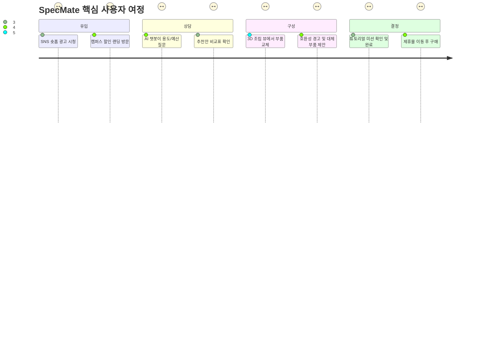
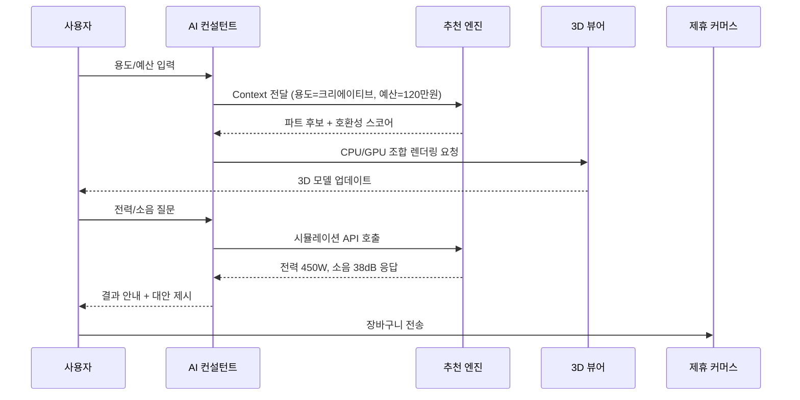
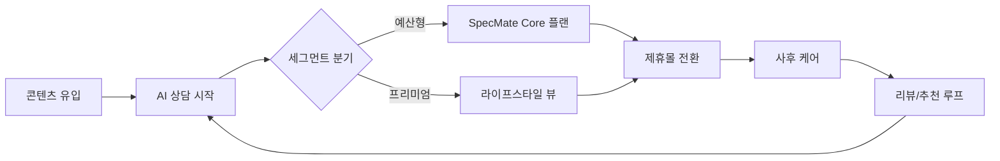
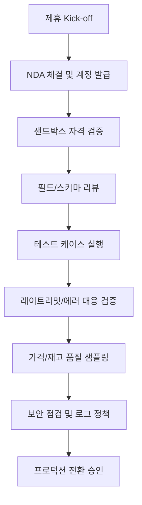

# SpecMate PC Advisor 기획서 (가칭)

## 목차
- [요약](#요약)
- [시장 및 수익 모델 검증](#시장-및-수익-모델-검증)
- [타깃 페르소나 및 가치 제안](#타깃-페르소나-및-가치-제안)
- [브랜드 포지셔닝 및 네이밍](#브랜드-포지셔닝-및-네이밍)
- [사용자 여정 및 UX 설계](#사용자-여정-및-ux-설계)
- [핵심 기능 명세](#핵심-기능-명세)
- [데이터 전략 및 스키마](#데이터-전략-및-스키마)
- [디자인 전략과 레퍼런스](#디자인-전략과-레퍼런스)
- [기술 스택 및 운영 계획](#기술-스택-및-운영-계획)
- [마케팅 및 성장 전략](#마케팅-및-성장-전략)
- [로드맵 및 팀 운영](#로드맵-및-팀-운영)
- [리스크 및 대응 전략](#리스크-및-대응-전략)
- [실행 체크리스트](#실행-체크리스트)
- [참고 자료](#참고-자료)

## 요약
- 타깃: 예산이 제한된 대학생·취업 준비생을 중심으로 한 초보 DIY 이용자, 서브 타깃은 합리적 소비를 추구하는 직장인 세컨드 PC 수요.
- 핵심 가치: AI 대화 기반으로 목적지향 조립(“과제+인강+캐주얼 게임”)을 안내하고, 3D 시각화와 학습 콘텐츠로 진입장벽을 낮춘다.
- 수익 모델: 제휴 커미션 + 광고 스폰서십 투트랙. 추천 리스트와 구매 전환을 데이터로 증명해 제휴사와 CPM/CPA 협상력 확보.
- 차별 포인트: 실시간 호환성 검증, 가격 변동 감시, 학습형 온보딩(튜토리얼/미션)과 커뮤니티형 피드백 루프.
- 레버: 3D configurator, AI 추천 엔진, 학생 특화 금융(할부/렌탈), 콘텐츠 커머스(가이드+프로모션).

## 시장 및 수익 모델 검증
| 인사이트 | 수치·사실 | 시사점 | 출처 |
| --- | --- | --- | --- |
| AMD Ryzen이 국내 DIY CPU 시장 55% 점유 | 2024년 7월 기준 AMD 55% vs Intel 45% | 가성비 선호가 뚜렷해 예산형 조립 수요가 크고 브랜드 편향이 낮음 | [ZDNet Korea](https://zdnet.co.kr/view/?no=20240819151615) |
| RTX 4060 계열 GPU 판매 비중 27.7% (4월) | RTX 4060 > 4060 Ti > 4070 SUPER 순 | 40만원대 중저가 그래픽카드가 메인스트림, 가격 민감층 확보 필요 | [Wccftech](https://wccftech.com/nvidia-geforce-gpus-popular-korean-diy-segment-rtx-4060-top-rtx-4070-super-strong-sales/) |
| 국내 e커머스 시장 227조원 규모 성장 | 프라이빗 LLM 결합으로 비교 서비스 고도화 전망 | 검증된 가격비교 데이터를 보유하면 AI 추천과 결합 시 경쟁력 확보 | [한국경제](https://www.hankyung.com/article/202402066960i) |
| 새 학기 학생 할인 공식 채널 이용 증가 | 삼성·애플·LG 캠퍼스 할인 15~30% 제공 | 학생층의 합리적 장비 구매 니즈가 높고, 제휴·광고 파트너 확보 용이 | [나남뉴스](https://www.nanamcom.co.kr/news/articleView.html?idxno=7773) |

**타깃·수익 모델 검증 결론**
- 예산형 GPU/CPU가 시장을 주도하며 가격 민감층이 메인스트림으로 확인되므로 “입문자/학생 중심” 가설이 타당하다.
- 제조사·유통사가 학생 할인 등 캠페인을 적극적으로 운영하므로 제휴 커미션 구조와 브랜디드 캠페인 매출화가 가능.
- 기존 비교 플랫폼의 AI 도입 움직임(다나와 VS검색+LLM)으로 보아 개인화 추천·대화 인터페이스는 차별화 요소이자 필수 역량.

## 타깃 페르소나 및 가치 제안
### 1차 페르소나: “민준” (22세, 수도권 대학생)
| 항목 | 내용 |
| --- | --- |
| 주요 목표 | 온라인 강의, 팀프로젝트, 캐주얼 게임을 무리 없이 실행하는 100만원 내외 데스크톱 구축 |
| Pain Points | 부품 호환성·전력 계산에 대한 불안, 가격 변동으로 인한 의사결정 지연, 설치/케이블 정리 경험 부족 |
| 디지털 행동 | 네이버 카페/디시인사이드/유튜브 리뷰 탐색, 삼성·애플 교육 할인 페이지 활용, 중고거래 정보 비교 |
| 성공 지표 | “브랜드/예산/성능” 3요소를 동시에 만족하는 추천안 확보, 조립 가이드로 셀프 완성, 3개월 이내 A/S 대응 |
### 2차 페르소나: “지현” (28세, UX 디자이너·재택 근무)
| 항목 | 내용 |
| --- | --- |
| 주요 목표 | 그래픽 툴·라이트 3D 작업용 미니타워 PC를 150만원 이하로 구성 |
| Pain Points | 현재 맥북에서 확장성 한계를 느낌, RGB/사이즈/소음 등 라이프스타일 요소 중요 |
| 디지털 행동 | 인스타/TikTok 숏폼 레퍼런스 소비, Dribbble/Behance 탐색, 프리미엄 케이스 브랜드 선호 |
| 성공 지표 | 시각적으로 완성된 3D 미리보기, 소음/온도 예측, 프리미엄 파트 번들 할인 |

### Jobs To Be Done & 가치 제안
- “나는 학업과 취미를 연결하는 첫 데스크톱을 사고 싶다. (민준)” → 예산 우선 추천, 호환성 자동 검증, 조립 튜토리얼 미션을 제공하여 실패 비용을 제거한다.
- “나는 삶의 공간과 어울리는 커스텀 빌드를 원한다. (지현)” → 3D 커스터마이저와 미학/소음 시뮬레이션, 디자인 옵션 비교를 지원한다.
- 공통 가치: “의사결정 마찰 최소화 + 시각적 이해 + 정책(할인/AS) 투명화”를 통해 신뢰도를 확보한다.

## 브랜드 포지셔닝 및 네이밍
- 브랜드 비전: “예산 안에서 최고의 경험을 설계해 주는 AI PC 컨설턴트”.
- 핵심 가치: 친근한 전문가, 투명한 데이터, 학습형 경험.
- 톤 앤 매너: 든든한 조교 같은 말투, 한국어 기반 명확한 어휘, 불필요한 전문 용어 최소화.
| 구분 | 이름 | 의미·메시지 | 비고 |
| --- | --- | --- | --- |
| 최종안 | SpecMate (스펙메이트) | “내 스펙을 함께 설계해 주는 친구”라는 의미. Mate가 주는 친근함 + Spec의 전문성 | 한글명 “스펙메이트” 병기 |
| 대안1 | FinFit PC Lab | Finance + Fit, 예산 최적화 연구소 느낌 | 재무 친화적 이미지 |
| 대안2 | CampusGear AI | 학생과 캠퍼스 제휴를 강조한 네이밍 | B2B(교육기관) 확장 시 사용 |

- 태그라인: “예산 안에서 완벽한 조합을, 단 10분 만에.”
- 비주얼 톤: 네온 민트(#2FF5C0), 딥 네이비(#07112B), 포인트 컬러로 코럴(#FF6F61) → 신뢰와 젊음을 동시에 전달.
- 브랜드 에셋: 한국어 가독성을 고려한 Pretendard + 영어 조합 Inter, 아이콘은 Fluency 공식 아이콘 세트 기반 커스터마이징.

## 사용자 여정 및 UX 설계
1. **유입**: 숏폼 광고·커뮤니티 콘텐츠 → 캠퍼스 제휴 랜딩 → AI 챗 스타트.
2. **발견**: 대화형 질문(사용 용도, 예산, 선호 브랜드) → 파트 카테고리별 추천 → 실시간 시세 비교.
3. **구성**: 3D 스켈레톤에 부품을 드래그&드롭, 호환성 경고·대안 제시.
4. **학습·결정**: 시뮬레이션(소음/온도/전력), 튜토리얼 미션, 전문가 리뷰, 커뮤니티 Q&A.
5. **구매·사후**: 제휴몰 딥링크/장바구니, 조립 서비스 옵션, 유지보수 알림, 가격 변동 알림.


### 단계별 UX 가이드
| 단계 | UX 목표 | 주요 UI 요소 | 수집 데이터 |
| --- | --- | --- | --- |
| 유입/랜딩 | 신뢰 확보, 할인 혜택 명시 | Hero 섹션에 캠퍼스 인증 배지, 실사용 후기 스니펫 | 유입 채널, 인증 여부 |
| 대화형 상담 | 부담 없는 정보입력 | Chip 기반 선택지, 자연어 입력, 진행률 표시 | 용도·예산·선호 브랜드 |
| 구성 | 시각적 이해 + 오류 제로 | 3D Viewer, 파트 리스트, 호환성 인디케이터, “비슷한 가격” 추천 | 파트 선택 로그, 교체 히스토리 |
| 결정 | 전환 강화, 리스크 경감 | 총예산 vs 예산 범위 그래프, 전력/온도 예상 카드, 프로모션 배너 | 최종 빌드, 구매 전환, 튜토리얼 완료율 |
| 유지 | 재방문 유도 | 가격 하락 알림, 부품 노후 알림, 사용자 빌드 보드 공유 | 재방문 빈도, 알림 CTR |
### 마이크로 카피 원칙
- “~해야 합니다” 대신 “이렇게 하면 더 안전해요”처럼 가이드형 표현.
- 복잡 용어에는 즉시 툴팁 노출 (예: “VRM” → “전원부, 안정성에 영향을 줍니다”).
- 접근성 고려: 16px 이상, 색 대비 4.5:1 이상 유지.


## 핵심 기능 명세
| 카테고리 | 기능 | 상세 설명 | 우선순위 | KPI/데이터 |
| --- | --- | --- | --- | --- |
| AI 상담 | 컨텍스트 기반 질문 플로우 | 목적/예산/선호를 자동 질문, 이전 답변 학습 | P0 | 상담 완료율, 입력 중도 이탈 |
| 추천 엔진 | 부품 후보 랭킹 + 호환성 체크 | 규칙 기반(소켓, 전력) + ML 유사 빌드 추천 | P0 | 추천 클릭률, 호환성 오류 0건 |
| 3D 시각화 | 스켈레톤 뷰 + 애니메이션 | react-three-fiber로 부품 위치/색상/LED 페인팅 | P0 | 모델 로드 시간, 인터랙션 횟수 |
| 가격 모니터링 | 실시간 시세 트래킹 | 제휴 피드/오픈마켓 API, 알림 설정 | P1 | 알림 opt-in율, 전환율 |
| 학습 콘텐츠 | 튜토리얼·미션 | “첫 조립”, “바이오스 업데이트” 등 단계별 가이드 영상 | P1 | 미션 완료율 |
| 커뮤니티 | 빌드 공유/리뷰 | 사용자 빌드 카드 공유, 댓글, AI 요약 | P2 | UGC 수, 공유 수 |
| A/S 헬프데스크 | 이슈 진단 챗봇 | 에러 코드 입력→해결 가이드, 서비스 센터 안내 | P2 | CS deflection 비율 |
## 데이터 전략 및 스키마
### 데이터 소스 및 수집
- **제휴 피드**: 다나와, 컴퓨존, 오픈마켓 제휴 API → Airbyte/커스텀 ETL로 30분 단위 동기화.
- **가격/재고**: GraphQL 캐싱 계층(Redis)으로 최근 24시간 변동 추이를 보관.
- **사용자 행동**: 상담 로그, 파트 선택 이력, 시뮬레이션 요청은 이벤트 스트림(Kafka/Redpanda)으로 수집.
- **지식 그래프**: 부품 간 호환성(소켓, 폼팩터, 전력)을 Neo4j/JanusGraph에 저장, 규칙 엔진과 ML 하이브리드.

### 핵심 테이블
| 테이블 | 주요 컬럼 | 설명 |
| --- | --- | --- |
| `users` | id, persona_type, budget_range, acquisition_channel, loyalty_tier | 사용자 기본 정보 및 세그먼트 |
| `build_sessions` | session_id, user_id, target_usecase, total_budget, status, created_at | 상담 세션 및 목표 |
| `component_catalog` | sku, category, brand, socket, watt, msrp, affiliate_partner, stock_status | 부품 마스터 |
| `compatibility_edges` | from_sku, to_sku, relation_type, score | 호환성 그래프 |
| `price_history` | sku, partner, price, scraped_at | 시세 변동 기록 |
| `recommendation_logs` | session_id, algorithm_version, presented_skus, outcome | 추천 성능 추적 |
```mermaid
flowchart LR
    A[제휴/오픈마켓 API] --> B[Airbyte/FastAPI ETL]
    B --> C[(PostgreSQL)]
    B --> D[(Redis 캐시)]
    C --> E[Neo4j 호환성 그래프]
    C --> F[Feature Store (Feast)]
    F --> G[추천 엔진]
    E --> G
    D --> G
    G --> H[AI 챗봇]
    H --> I[Amplitude/PostHog 이벤트]
    I --> J[Looker/Metabase 대시보드]
```

- **데이터 품질 관리**: 가격 이상치(±40% 변동) 자동 감지, 호환성 검증 시 그래프 무결성 검사, 사용자 신고 피드백 루프.
- **프라이버시**: 비식별화된 행동 로그 저장, 개인정보는 KMS 암호화.
## 디자인 전략과 레퍼런스
### 디자인 원칙
1. **Progressive Reveal**: 초보자는 기본 추천만, 고급 사용자는 고급 옵션(전압, 램 타이밍)을 확장.
2. **Visual-first**: 3D 모델과 실제 크기 비교(예: 케이스 vs 13인치 노트북) 오버레이 제공.
3. **한국어 우선**: 한글 줄바꿈, 조사 자동 보정, 폰트 가독성(가변 폰트 사용).
4. **Fun + Trust**: 색상 대비로 신뢰 확보, 마이크로 애니메이션으로 흥미 유지.

### 레퍼런스 & 적용 계획
| 유형 | 레퍼런스 | 링크 | 적용 포인트 |
| --- | --- | --- | --- |
| PC Builder 비전 | PageOn.ai “The Future of PC Builder Websites” | https://www.pageon.ai/blog/pc-builder-website | 스토리텔링형 구성, AI 대화 강조 |
| 3D Configurator | AVADA MEDIA PC Configurator | https://avada-media.com/expertise/3d-2d-configurators/pc-and-gadgets-configurator/ | 2D/3D 하이브리드 UI 구조 |
| 럭셔리 커스터마이징 | Prada America’s Cup 3D Configurator (Accenture) | https://www.accenture.com/ca-en/case-studies/song/prada-luxury-product-customization | 고품질 3D, 실시간 렌더 성능 기준 |
| UI 레퍼런스 | Dribbble PC Builder 태그 | https://dribbble.com/tags/pc-builder | 카드형 비교, 히어로 모듈 사례 |
| Figma 템플릿 | Figma Community - PC Builder | https://www.figma.com/community/file/1212346938592087074/pc-builder | 오토레이아웃 기반 모듈, 신속한 와이어 |
| 3D UI 보조 | 3D UI Generator (Figma plugin) | https://www.figma.com/community/design-templates | 3D 시각화 목업 제작 |
> 브라우저 캡처 요청: 상기 레퍼런스 주요 화면을 MCP 캡처 툴로 수집하여 Appendix 이미지 섹션에 추가할 것.

### 디자인 시스템 & 툴
- Figma + Tokens Studio로 컬러/타이포 토큰 관리 → Style Dictionary → Storybook Sync.
- Motion: LottieFiles, Framer Motion (React) 기반. 마이크로 인터랙션 캘리브레이션은 ProtoPie.
- 3D Asset 파이프라인: Blender → GLTF → gltfjsx (react-three-fiber 변환). 간편화 위해 Spline 활용 가능.
- 접근성 체크: Stark/Figma Contrast, Axe DevTools.

### 한국어 UX 체크리스트
- 20자 이내 문장, 조사 자동화, 단위(만원/와트) 명확 표시.
- VOC 분석 기반 FAQ 사전 배치, “초보자 모드” 토글.
## 기술 스택 및 운영 계획
### 프런트엔드 & 3D
| 영역 | 선택지 | 장점 | 리스크 | 적용 전략 |
| --- | --- | --- | --- | --- |
| 프레임워크 | Next.js 15 (App Router) | 서버 컴포넌트로 초기 로딩 최적화, Vercel 배포 용이 | 에지 캐시 전략 필요 | SSR + SSG 혼합, 지역별 가격 캐시 |
| 상태관리 | Zustand | 경량·학습곡선 낮음, selector 기반 성능 | 비동기 패턴 관리 직접 구현 필요 | React Query와 병행, 세션 상태에만 적용 |
| 대안 | Jotai | 원자 단위 관리, 다국어 처리와 궁합 | 디버깅 툴 제한 | Form/입력 단계에 제한적 사용 |
| 3D 렌더 | react-three-fiber + drei | React 생태계 통합, 커뮤니티 활발 | 고사양 기기 의존 | 디그레이드 모드(정적 이미지) 지원 |
| 3D 대안 | Babylon.js | 고급 PBR 효과 | 러닝 커브 | 하이엔드 데모에만 선택적 도입 |
| 스타일 | Tailwind CSS + Radix UI | 빠른 빌드, 접근성 구성요소 | 디자인 일관성 관리 필요 | 디자인 토큰 연동, Storybook 시각 테스트 |
### 백엔드 & AI
| 영역 | 선택지 | 장점 | 리스크 | 적용 전략 |
| --- | --- | --- | --- | --- |
| API 서버 | FastAPI | Python 생태계(데이터, AI)와 궁합, 비동기 지원 | 타입 안전성 | Pydantic + OpenAPI 문서 자동화 |
| 추천 엔진 | LangChain + OpenAI Assistants | 프롬프트 관리, 도구 실행 | 비용·속도 | 캐시 레이어, 중요 경로는 자체 파인튜닝 |
| Knowledge Graph | Neo4j Aura | 시각화 및 Cypher 편의 | 비용 | JanusGraph + AWS Keyspaces 대체 검토 |
| 데이터 ETL | Airbyte | 커넥터 다수, 모니터링 | 커스텀 커넥터 개발 필요 | 가격 API 커넥터 커스터마이징 |
| 실시간 | Redis Streams / Kafka | 이벤트 스트림 | 운영 복잡성 | 초기엔 Managed Kafka(Confluent Cloud) |

### 운영/DevOps
- Monorepo(Turborepo)로 FE/BE 패키지 관리, GraphQL 코드젠 통일.
- CI/CD: GitHub Actions → Vercel (FE), AWS ECS/Fargate (BE), Neon/Supabase (DB).
- QA: Playwright E2E, Cypress 시각 리그레션, Storybook Chromatic.
- 옵저버빌리티: OpenTelemetry + Datadog, 로그는 Loki/Grafana.
- 보안: OAuth2 (학교 이메일 인증), WAF, 비공개 API 키 KMS 관리.

### 분석·마케팅 툴
- 제품 분석: Amplitude (행동 군집, 세그먼트 실험), PostHog 자가 호스팅.
- 마케팅 자동화: Braze (리텐션), Klaviyo (이메일), Branch (딥링크).
- 사용자 테스트: Maze 원격 테스팅, Lookback 녹화, UsabilityHub 카드 소팅.
## 마케팅 및 성장 전략
### 채널 믹스
| 단계 | 채널 | 실행 아이디어 | 지표 |
| --- | --- | --- | --- |
| 인지도 | TikTok/YouTube Shorts | “10분 만에 90만원 PC 상담” 시리즈, 크리에이터 협업 | CPM, 조회수 |
| 획득 | 캠퍼스 제휴 랜딩 | 학교 이메일 인증시 추가 할인 쿠폰, 갤럭시 캠퍼스/애플 교육 스토어 크로스 프로모션 | CVR, 인증율 |
| 고려 | 커뮤니티 AMA | 디씨인사이드/루리웹 Q&A, 라이브 빌드 세션 | 세션수, 질문수 |
| 전환 | 추천 번들 프로모션 | 제휴몰 번들(케이스+쿨러) 한정 딜, 학생 전용 6개월 무이자 | 장바구니 전환율 |
| 유지 | 가격하락/품절 알림 | 알림 · 디스코드 봇, “내 빌드 팔로우” 기능 | 재방문율, 알림 CTR |


### 측정 및 실험
- 북극성 지표: “AI 상담 완료 후 제휴몰 전환율”.
- 보조 지표: 상담 완료율, 추천 클릭률, 3D 뷰 체류시간, 튜토리얼 완료율.
- 실험: 
  - A/B: “예산 대비 퍼포먼스 그래프 vs 총 비용 그래프”.
  - 멀티암: 추천 알고리즘 버전(규칙 vs ML).
- 리텐션 전략: 주기적 성능 리뷰 리포트, 부품 가격 낙폭 알림, 커뮤니티 챌린지(“10만원 아끼기 챌린지”).

### 파트너십
- 제조사 협력: AMD, NVIDIA, 삼성 메모리 등과 언박싱/스폰서십.
- 금융: BNPL(토스페이, 쿠팡페이) 연동으로 학생 할부 지원.
- 서비스: 오프라인 조립 대행 업체와 연동, A/S 픽업 서비스.
## 로드맵 및 팀 운영
### 3단계 실행 로드맵 (10명/12주 가정)
| Phase | 기간 | 목표 | 주요 딜리버러블 |
| --- | --- | --- | --- |
| Phase 0: Discovery | 2주 | 타깃 검증, 데이터 소스 확보 | 사용자 인터뷰 10건, 경쟁 분석, 데이터 계약 MOU |
| Phase 1: PoC | 4주 | AI 상담 + 기본 추천 | 대화형 프로토타입, MVP 백엔드, 2D 견적표 |
| Phase 2: MVP | 4주 | 3D 시각화 + 가격 모니터링 | 3D 뷰어, 호환성 그래프, 제휴 API 연결 |
| Phase 3: Growth | 2주 | 마케팅/분석 고도화 | 캠퍼스 제휴 론칭, Amplitude 대시보드, 알림 시스템 |

### 팀 구성 제안
| 역할 | 인원 | 책임 |
| --- | --- | --- |
| PM/PMM | 1 | 로드맵, KPI, 파트너십 |
| UX 리서처/디자이너 | 2 | 사용자 조사, UX 플로우, 디자인 시스템 |
| 3D 디자이너/테크 아티스트 | 1 | 3D 에셋 제작, 퍼포먼스 튜닝 |
| 프런트엔드 엔지니어 | 2 | Next.js, 3D 뷰어, 상태관리 |
| 백엔드/데이터 엔지니어 | 2 | API, 데이터 파이프라인, 그래프 |
| ML/추천 엔지니어 | 1 | 모델 설계, 평가 |
| 마케팅/그로스 | 1 | 캠페인, 커뮤니티, 분석 |

- 협업 툴: Linear(이슈), Notion(문서), FigJam(워크숍), Slack+Atlas(의사결정 로그).
- 주간 리듬: 월요일 스프린트 킥오프, 수요일 디자인/개발 합동 리뷰, 금요일 그로스 리뷰.
## 리스크 및 대응 전략
| 리스크 | 내용 | 대응 방안 |
| --- | --- | --- |
| 데이터 품질 | 제휴 데이터 지연/불일치 | 다중 소스 교차검증, 가격 이상치 알림, 수동 검수 툴 |
| 모델 신뢰도 | AI 추천 오류, 잘못된 호환성 | 룰 기반 최소 안전장치, 사용자 피드백 루프, 온라인 평가 벤치마크 |
| 퍼포먼스 | 3D 뷰 로딩 지연 | LOD(Level of Detail), SSR에서 정적 이미지 대체, WebGL Capability 체크 |
| 제휴 의존 | 특정 파트너 의존도 | 다각적 제휴, 자체 재고/공동구매 옵션, 광고 모델 다변화 |
| 법규/보안 | 개인정보, 전자상거래 규정 | 한국 전자상거래법 준수, 로그 비식별화, 취소/환불 프로세스 명문화 |
## 실행 체크리스트
- [ ] 1차 인터뷰(학생 6명, 사회초년생 4명) 완료 및 페르소나 검증.
- [ ] 다나와/컴퓨존 제휴 데이터 샌드박스 API 키 확보.
- [ ] 3D 에셋 우선순위 리스트(CPU, GPU, 메인보드, 케이스 Top 10) 확정.
- [ ] AI 상담 스크립트 MVP(10 질문 내외) 작성 및 Tone 리뷰.
- [ ] Amplitude 이벤트 설계서/데이터 레이어 정의.
- [ ] MCP 브라우저 캡처: 주요 레퍼런스 화면, 컴피티터 UI 수집.
- [ ] 캠퍼스 이메일 인증 플로우 UX 프로토타입 테스트.
## 참고 자료
| 번호 | 내용 | 링크 |
| --- | --- | --- |
| [1] | AMD 라이젠 국내 조립PC 시장 과반 점유 (2024.08) | https://zdnet.co.kr/view/?no=20240819151615 |
| [2] | NVIDIA RTX 4060/4070 SUPER 한국 DIY 판매 데이터 (2024.05) | https://wccftech.com/nvidia-geforce-gpus-popular-korean-diy-segment-rtx-4060-top-rtx-4070-super-strong-sales/ |
| [3] | 다나와 VS검색 + 프라이빗 LLM 도입 기사 | https://www.hankyung.com/article/202402066960i |
| [4] | 새 학기 대학생 할인 수요 기사 | https://www.nanamcom.co.kr/news/articleView.html?idxno=7773 |
| [5] | PC Builder UX 미래 비전 블로그 | https://www.pageon.ai/blog/pc-builder-website |
| [6] | 3D Configurator 사례 | https://avada-media.com/expertise/3d-2d-configurators/pc-and-gadgets-configurator/ |
| [7] | Prada 온라인 커스터마이징 사례 | https://www.accenture.com/ca-en/case-studies/song/prada-luxury-product-customization |
| [8] | GitHub 3D configurator 템플릿 | https://github.com/Madewill/3d-product-configurator |
| [9] | Dribbble PC Builder 레이아웃 모음 | https://dribbble.com/tags/pc-builder |
| [10] | Figma PC Builder 템플릿 | https://www.figma.com/community/file/1212346938592087074/pc-builder |

## 캠퍼스 제휴 및 API 샌드박스 실행 플랜
### 우선순위 파트너 후보
| 분류 | 기관/서비스 | 핵심 제안 가치 | 담당 부서/연락 포인트 | 메모 |
| --- | --- | --- | --- | --- |
| 제조사 교육몰 | 삼성 Galaxy Campus | 학생 전용 번들 프로모션 + SpecMate 추천 데이터 제공 | 교육/캠퍼스 마케팅팀 | 다건 제휴 시 연간 성과 리뷰 제안 |
| 제조사 교육몰 | Apple Education Store | 디자인/크리에이티브 PC 서브타깃 확보, 애플 ↔ SpecMate 비교 가이드 | Apple Korea Education Partnership | 온라인 전용, 콘텐츠 협업 필요 |
| 제조사 교육몰 | LG 아카데미 스토어 | 모니터/주변기기 번들 협업, 오프라인 팝업 연계 | B2C 전략마케팅팀 | 인증 프로세스 간소화 요청 필요 |
| 유통/비교 플랫폼 | 다나와(커넥트웨이브) | 가격/재고 실시간 데이터 + SpecMate 전용 VS검색 임베드 | 데이터비즈니스실 | LLM 연동 PoC 제안 포함 |
| 금융/BNPL | 토스페이, 쿠팡페이 | 학생 무이자할부/BNPL 연동, 전환율 향상 | 파트너십 BD | API 보안·정산 일정 협의 |

### 제휴 제안서 구성 요소
- 문제 정의: 학생/입문자 대상 기존 구매 여정의 마찰 지점과 파트너가 해결할 수 있는 부분.
- 솔루션 개요: SpecMate 상담 플로우, 3D 구성, 가격 알림 기능 소개.
- 예상 KPI: 상담→제휴몰 전환율, 파트너 브랜드 노출 지표, 공동 캠페인 퍼포먼스 가설.
- 데이터/리포트 제공안: 월별 리포트 템플릿, 퍼널 분석, 사용자 피드백 요약.
- 실행 로드맵: 킥오프→데이터 연동→공동 캠페인→성과 리뷰 4단계.
- 법무/보안: 개인정보 최소화, 비식별 로그 제공, WAF·OAuth2 정책 요약.

### 데이터 샌드박스 확보 체크리스트
1. 내부 준비 문서: 회사 소개서, 보안 정책, 개인정보 처리방침, KISA/ISMS 등 인증 현황.
2. 파트너별 요구 서류: NDA, KYC, API 사용 신청서, 과금 구조 확인.
3. 기술 항목: 호출 한도, 인증 방식(API Key/OAuth), 응답 포맷(JSON/CSV), 타임존.
4. 운영 항목: 장애 신고 채널, 지원 SLA, 샌드박스→프로덕션 전환 절차.
5. 데이터 거버넌스: 저장 기간, 암호화 방식, 로그 접근 통제 계획.

### API 검증 프로토콜

- 테스트 케이스: 가격 변동 추적, 품절/재고 0 처리, 제휴 링크 유효성, 시간 지연 시나리오.
- 관측 포인트: 응답 지연(ms), 실패율(%), 필수 필드 누락 비율, 캐싱 갱신 주기.
- 결과 보고: QA 리포트 템플릿(요약, 이슈, 조치), SLA 위반 시 재시험 일정.

## 사용자 인터뷰 & AI 상담 스크립트 실행 플랜
### 리크루팅 전략
| 세그먼트 | 모집 채널 | 필수 조건 | 목표 N | 인센티브 |
| --- | --- | --- | --- | --- |
| 대학생/취준생 | 대학 커뮤니티, 인스타 타겟 광고 | 예산 70~120만원, DIY 경험 0~1회 | 8 | 3만원 상품권 |
| 사회초년생/재택직장인 | 링크드인, 패션/디자인 커뮤니티 | 그래픽/크리에이티브 작업 빈도, 맥북 사용자 | 5 | 4만원 상품권 |
| PC 입문 가족케어층 | 맘카페, 네이버 지식인 | 가족/동료 PC 구매 돕는 경험, 예산 민감 | 4 | 3만원 상품권 |

### 4주 실행 타임라인
- Week 1: 스크리너/설문 배포, 참가자 섭외 확정, 동의서·보안 교육.
- Week 2: 인터뷰 1차(5명) + 사용자 과업 테스트, Wizard-of-Oz 채팅 시나리오 파일럿.
- Week 3: 인터뷰 2차(6명) + 카드소팅, 초기 NLU 표현 수집, 통합 노트 정리.
- Week 4: 인사이트 합성 워크숍, 페르소나 업데이트, AI 스크립트 v1, 리포트 공개.

### 인터뷰 세션 구성
1. 도입(5분): 목표 공유, 해지권 안내, 동의서 확인.
2. 워밍업(5분): 최근 PC 구매·리서치 경험 탐색.
3. 핵심 과업(25분): SpecMate 와이어프레임 기반 탐색, 질문/선택 행동 관찰.
4. 마무리(10분): 기능 우선순위 카드소팅, 개선 아이디어, 인센티브 공지.
5. 기록: 비디오/오디오, 실시간 노트(미로/Notion), 행동 태그(의심, 확신 등).

### 자료화 & 분석 프로세스
- 템플릿: Observation Log, Emotion Timeline, Quote Bank, JTBD 매핑 보드.
- 코딩 규칙: Pain, Desire, Trigger, Objection 4가지 라벨, 중요도(High/Medium/Low).
- 합성 워크숍: 팀별 Affinity Diagram → Insight Statement → Opportunity Solution Tree 업데이트.
- 산출물: 인터뷰 리포트(요약 슬라이드 5p), 페르소나 개정, 여정 지도 업데이트.

### AI 상담 스크립트 프로토타이핑
| 단계 | 산출물 | 세부 내용 |
| --- | --- | --- |
| Intent 설계 | Intent 리스트 v0.1 | 예산, 용도, 브랜드 선호, 호환성 불안 등 12개 Intent 정의 |
| 대화 플로우 | Wizard-of-Oz 시나리오 | Figma FigJam 플로우 + Notion 응답 스크립트, 분기별 가드레일 명시 |
| NLU 데이터 | 발화 데이터셋 | 인터뷰/커뮤니티에서 수집한 문장 300개, Synonym/Entity 태깅 |
| 검증 | 파일럿 테스트 | 내부 스태프 5명 QA, 실패 케이스 기록, 룰 기반 백스탑 추가 |

### NLU 학습 데이터 구조 예시
```text
utt_id,intent,utterance,entities,notes
BUDGET_001,budget_under100,"100만원 이하로 가능한가요?","{\"budget_max\":\"1000000\"}",민준 페르소나 발화
USECASE_014,usecase_multi,"영상 편집도 조금 해야 해요","{}",세컨더리 요구 파악
```
- 관리 도구: Google Sheets → JSON Export → LangChain CSVLoader.
- 버전 관리: Git LFS + DVC(Data Version Control)로 데이터 변경 추적.

## Appendix 이미지 캡처 갤러리
| 레퍼런스 | 캡처 파일(플레이스홀더) | 포커스 영역 | 적용 포인트 | 체크 메모 |
| --- | --- | --- | --- | --- |
| PageOn.ai – Future of PC Builder |  | 스토리텔링 히어로, AI 챗 CTA | 온보딩 시나리오, 대화형 배너 | 모바일/데스크톱 2종 캡처 |
| AVADA MEDIA PC Configurator |  | 3D/2D 하이브리드 인터페이스 | Skeleton + 파트 레이어 UI | 회전/줌 인터랙션 GIF 필요 |
| Prada America’s Cup Configurator |  | 럭셔리 UI, 실시간 재질 변경 | 하이엔드 모드/디그레이드 전략 | 고품질 렌더, 로딩 표현 캡처 |
| Dribbble PC Builder Shots |  | 카드형 비교, CTA 배치 | 가격 비교 카드, 톤앤매너 | 저작자 표기 필수 |
| Figma Community PC Builder Template |  | 오토레이아웃 구조 | 컴포넌트 재사용, 토큰 매핑 | 프레임 이름/레이어 구조 캡처 |
| GitHub 3D Configurator Repo |  | 프로젝트 구조, 코드 스니펫 | R3F 세팅, GLTF 파이프라인 | README, 폴더 구조 절반씩 캡처 |

### Appendix 캡처 가이드
1. 해상도: 기본 1920×1080, 필요 시 1440×900(모바일), PNG 포맷 권장.
2. 브라우저: Chromium 기반(Chrome/Edge) + 개발자도구 Device Toolbar로 반응형 캡처.
3. 주석: Figma 또는 Scribehow로 Key UI 요소(색상, CTA, Copy) 명시.
4. 메타데이터: 캡처 일시(KST), URL, 접근 권한, 기능 변화 기록.
5. 저장 경로: `assets/reference/<source>/<yyyymmdd>_<descriptor>.png` 구조.
6. 버전 관리: Git LFS 등록 + Appendix 표 업데이트, 변경 이력 Notion DB 연동.

### Appendix 후속 체크리스트
- [ ] 1차 캡처 업로드 및 이미지 경로 교체.
- [ ] 본문 각 섹션에 `[관련 Appendix 항목]` 레퍼런스 링크 추가.
- [ ] 분기별 레퍼런스 검토 캘린더(Asana) 생성.
- [ ] 캡처 자동화 도구(Playwright screenshot) PoC 진행.

#### 캡처 브리프 & 주석 가이드
| Appendix ID | 레퍼런스 | 캡처 포커스 | 강조 UI 패턴 | 주석/메모 | 출처 |
| --- | --- | --- | --- | --- | --- |
| A1 | PageOn.ai – Future of PC Builder Websites | 히어로 섹션 + 대화형 CTA | 스토리텔링 콘텐츠 블록, AI 챗 CTA 버튼, 역동적 스크롤 히어로 | CTA 버튼에 “Start your build” 문구 하이라이트, 카피 옆에 “감성 스토리텔링” 주석 | https://www.pageon.ai/blog/pc-builder-website |
| A2 | AVADA MEDIA 3D Configurator Demo | Skeleton 뷰와 파트 레이어 토글 | 3D 뷰 조작 패널, 파트 리스트 hover 정보, 2D 썸네일 → 3D 싱크 | 회전/줌 아이콘과 실시간 업데이트 동작 화살표 표현 | https://avada-media.com/demo-apps/3d-konfigurator-slider/ |
| A3 | Prada America’s Cup Configurator (Accenture) | 재질/색상 옵션 패널 + 3D 모델 | 초고해상도 디지털 트윈, 실시간 렌더 상태, 초기/결과 비교 UI | 렌더 서버 언급 텍스트 박스, 품질/속도 KPI 언급 | https://www.accenture.com/us-en/case-studies/song/prada-luxury-product-customization |
| A4 | Dribbble PC Builder Shots | 카드형 비교 리스트, CTA 영역 | 가격/성능 뱃지, 선택 상태 표시, 고대비 CTA 버튼 | 카드 대비 컬러/아이콘 사용 주석, CTA 마이크로카피 수집 | https://dribbble.com/tags/pc-builder |
| A5 | Figma Community – PC Builder Template | Auto Layout 구조, 컴포넌트 패널 | 레이어 네이밍, 오토레이아웃 패딩, 토큰 연동 구조 | Frame 이름/토큰 바인딩 주석, 향후 Tokens Studio 연동 TODO | https://www.figma.com/community/file/1212346938592087074/pc-builder |
| A6 | GitHub – 3D Product Configurator (R3F) | 폴더 구조 + GLTF 파이프라인 | `src/components` 구조, `gltfjsx` 변환 스크립트, Zustand 상태 패턴 | 빌드 스크립트 주석, 추천 의존성 목록 표시 | https://github.com/Madewill/3d-product-configurator |

#### 촬영 시나리오 단계
1. **사전 세팅**: Chrome + DevTools Device Toolbar로 데스크톱(1440px)과 모바일(390px) 두 해상도 준비. Lightshot/Snagit 등 주석 툴 프리셋 구성.
2. **스크롤 스토리라인**: 각 레퍼런스별로 “전체 화면 → 핵심 UI → 상호작용 상태” 3세트 캡처. Prada 사례는 소재/초기/완성 3단계, AVADA는 회전+반전.
3. **주석 레이어**: Figma 파일 `appendix/reference-annotations.fig`에서 캡처 이미지를 불러와 Appendix ID별로 아트보드 구성, 컬러 토큰(민트/코럴)으로 하이라이트 표시.
4. **메타데이터 기록**: Notion 데이터베이스 `SpecMate Reference Captures`에 Appendix ID, URL, 캡처 일시(KST), 해상도, 이미지 경로(`assets/reference/...`) 입력.
5. **본 문서 링크 업데이트**: 각 본문 섹션(디자인 전략, UX 설계 등)에 `[Appendix A#]` 형식으로 교차 참조 추가.

#### 캡처 후 파일 구조 예시
```text
assets/
  reference/
    pageon/20241030_hero-desktop.png
    pageon/20241030_chat-mobile.png
    avada/20241030_view-controls.gif
    prada/20241030_material-panel.png
    dribbble/20241030_cards-desktop.png
    figma/20241030_autolayout.png
    github-r3f/20241030_structure.png
```
- 상세 비주얼/주석 가이드는 Appendix A1~A6을 참조한다.
### 제휴 Outreach 타임라인 (초기 6주)
| 주차 | 주요 액션 | 산출물 | 의존 관계 |
| --- | --- | --- | --- |
| Week 0 | 내부 킥오프, KPI 재확인 | 제휴 브리프, KPI 시트, 보안 FAQ | 기존 기획서 정합성 |
| Week 1 | 1차 접촉(이메일/LinkedIn), 비공식 탐색 미팅 | 미팅 로그, 요구사항 체크리스트 | 파트너별 의사결정 구조 파악 |
| Week 2 | 파트너 Needs 분석, 맞춤형 제안서 업데이트 | 커스터마이즈 제안서, ROI 모델 | 파트너 피드백 |
| Week 3 | 보안/법무 실무 협의, NDA 체결 | 서명된 NDA, 보안 질문 리스트 답변 | 내부 보안/법무 리뷰 |
| Week 4 | 샌드박스 계정 발급요청, 기술 워크숍 | API 명세, 인증키/테스트 계정 | 파트너 Dev 팀 일정 |
| Week 5 | 샌드박스 테스트, 품질 리포트 공유 | 테스트 리포트, 이슈 트래커 | QA 팀 가용성 |
| Week 6 | PoC 리뷰 및 론치 플랜 확정 | 공동 론치 일정, 마케팅 코-브랜딩 플랜 | Week 5 테스트 결과 |

### 파트너 스코어링 매트릭스 (가중치 모델)
| 평가 항목 | 설명 | 가중치 | 점수 범위 | 참고 데이터 |
| --- | --- | --- | --- | --- |
| 사용자 트랙픽 적합도 | 타깃(학생/입문자)과의 매칭 정도 | 0.25 | 1~5 | 제휴사 UV, 캠퍼스 인증 사용자 비율 |
| API 데이터 품질 | SKU 커버리지, 업데이트 주기, 히스토리 depth | 0.2 | 1~5 | 샌드박스 샘플, 기존 벤더 레포트 |
| 프로모션/혜택 유연성 | 할인율, 번들 구성 권한, 공동 캠페인 의지 | 0.15 | 1~5 | 제휴 제안, 과거 캠페인 사례 |
| 기술 응답 속도 | SLA, 지원 채널, 이슈 해결 평균 시간 | 0.15 | 1~5 | SLA 문서, 레퍼런스 체크 |
| 법/보안 적합성 | 개인정보 처리, KISA/ISMS 등 인증 | 0.1 | 1~5 | 보안 문서, 감리 보고 |
| 상업 조건 | 커미션율, 정산주기, 마케팅 펀드 | 0.15 | 1~5 | 제안서, 계약서 초안 |
> 총점 = Σ(가중치 × 점수). 3.5 이상 파트너를 1차 론치 후보로 선정.

### 제안 이메일 템플릿 (한국어)
```
제목: [SpecMate] 캠퍼스 PC 구매 경험 혁신 제휴 제안

안녕하세요, [파트너 담당자명]님.
학생·입문자 대상 AI 기반 PC 컨설팅 서비스 ‘SpecMate’를 준비 중인 박재석 드림입니다.

[파트너명]에서 제공하는 [학생 전용 할인/데이터 자산]이 저희 핵심 타깃과 높은 시너지를 낼 것으로 판단하여 다음과 같은 협업을 제안드립니다.
1) 데이터/상품 제휴: [API/피드] 기반 실시간 가격·재고 연동
2) 캠퍼스 프로모션: SpecMate AI 상담 완료 고객 대상 [혜택]
3) 리포트 공유: 상담 데이터 기반 인사이트 리포트 월 1회 제공

2주 내 30분 정도의 온라인 미팅이 가능하실지요? 가능한 일정 2~3개 공유해 주시면 감사하겠습니다.

감사합니다.
박재석
SpecMate PM
연락처: xxx-xxxx-xxxx | 이메일: xxx@specmate.ai
```

### 데이터 매핑 & 파이프라인 준비 자료
- **필수 필드 목록**: SKU, 파트 타입, 브랜드, 가격(최저/정가), 재고 상태, 이미지 URL, 스펙(소켓/모델 넘버), 제휴 URL.
- **변환 규칙**: 파트 카테고리를 SpecMate `component_catalog` 분류 체계로 매핑 (예: `CPU > AMD` → `cpu.amd`).
- **검증 스크립트**: Python + Great Expectations로 필수 필드 Null 비율, 가격 편차, 재고 플래그 불일치 검출.
- **캐싱 전략**: 가격 변동 폭이 큰 SKU는 Redis TTL 15분, 기타 60분. 동일 SKU의 파트너 가격은 Max 10개 유지.

### 샌드박스 테스트 케이스 상세 (발췌)
| TC ID | 시나리오 | 입력/설정 | 기대 결과 |
| --- | --- | --- | --- |
| TC-01 | 기본 가격 조회 | SKU=CPU123 호출 | 200 OK, 가격 필드 1개 이상, `currency=KRW` |
| TC-04 | 재고 품절 처리 | 테스트 SKU 재고=0 | 응답에 `stock_status=out_of_stock`, 딥링크 disable |
| TC-07 | 레이트리밋 대응 | 1초 10회 호출 | 429 발생 시 Retry-After 확인, 백오프 적용 |
| TC-11 | 프로모션 플래그 | 이벤트 SKU | `promotion` 필드 true, 유효기간 포함 |
| TC-15 | Failover | API 장애 후 캐시 fallback | 마지막 정상 캐시값 서빙, 에러 알림 Slack 전송 |

### 공동 론치 퍼널 KPI 예시
- 상담 → 제휴몰 전환률: 18% 목표 (기준 대비 +6pp).
- 제휴몰 방문자 중 구매 전환률: 12% 목표.
- 파트너 신규 캠퍼스 회원 수: 론치 4주 내 2,000명.
- 월간 제공 리포트: 상담 질문 상위 10개, 전환 SKU 상위 20개, 가격 변동 알림 클릭률.
### 스크리너 설문 문항 (Typeform/Google Form)
1. 현재 거주 지역 및 학교/직장 구분 (학생, 취준생, 재택직장인 등).
2. 데스크톱/노트북 구매 계획 시기 (1개월 이내/3개월 이내/미정).
3. 예상 예산 범위 (단일 선택: 70~90만원, 90~120만원, 120~150만원, 150만원 이상).
4. DIY 경험 횟수 (없음/1회/2회 이상) 및 어려웠던 지점 서술형.
5. 주요 사용 목적 복수 선택 (강의/과제, 디자인, 영상 편집, 게임 등) + 우선순위.
6. 캠퍼스 이메일 또는 인증 가능한 신분 증빙 여부.
7. 인터뷰/사용성 테스트 참여 가능 시간대 (주중 저녁, 주말 오후 등) 및 화상 툴 선호.
8. 개인정보 수집/활용 동의 체크.

### 인터뷰 세션 스크립트 (35분 기준)
- **인트로 (2분)**: “오늘 세션은 SpecMate 초기 프로토타입의 사용성을 탐색하는 자리입니다…”
- **배경 질문 (5분)**: 최근 PC 구매 리서치 과정, 사용한 채널, 의사결정 요인.
- **핵심 과업 A (10분)**: Figma Prototype에서 AI 상담 Flow 수행 → 발화/클릭 기록 → “다음 질문은 어떤 순서가 자연스러웠나요?”
- **핵심 과업 B (10분)**: 3D Viewer 와이어프레임에서 부품 교체 시나리오 → 호환성 경고 반응 관찰.
- **Wrap-up (8분)**: 가치 평가(10점 척도), 기능 우선순위 카드소팅, 추천 의향 NPS, 추가 아이디어.

### Wizard-of-Oz 상담 스크립트 v0.1 (발췌)
```
Bot: 안녕하세요! 첫 PC 구성을 도와드릴게요. 우선 어떤 용도로 가장 많이 사용하실 예정인가요?
User: 인강이랑 캐주얼 게임 위주예요.
Bot: 인강/캐주얼 게임이라면 그래픽 옵션을 크게 높이지 않아도 돼요. 예산 범위를 알려주실 수 있을까요?
User: 100만원 안쪽이면 좋겠어요.
Bot: 좋아요. 현재 100만원 예산 내에서 CPU는 AMD Ryzen 5 7600, GPU는 RTX 4060 조합이 가장 많이 선택되고 있어요. 혹시 브랜드 선호가 있을까요?
User: AMD 쪽이 끌리긴 해요.
Bot: 그럼 AMD 메인보드와 DDR5 메모리 조합으로 맞춰볼게요. 소음이나 케이스 크기에 대한 우선순위도 알려주세요.
```
- 라벨링 규칙: Intent(`usecase_study`, `budget_under100`, `brand_preference_amd`, `lifestyle_noise`).
- 백오프 문구: “말씀하신 부분을 기록해둘게요. 추가로 중요한 조건이 있으면 알려주세요.”

### NLU 학습 데이터셋 확장 계획
| Intent | 예시 발화 | Entity | 메모 |
| --- | --- | --- | --- |
| budget_under120 | “120만원 안에서 가능할까요?” | `{ "budget_max": 1200000 }` | 구어체 숫자 처리 (만원 → 원) |
| usecase_graphic | “피그마랑 어도비 작업 자주 해요” | `{ "tools": ["Figma", "Adobe"] }` | 복합 용도 라벨링 |
| concern_noise | “소음이 적었으면 좋겠어요” | `{ "noise_priority": "high" }` | 후속 추천 시 팬/케이스 필터 |
| financing_need | “할부 같은 거 있나요?” | `{ "financing": true }` | BNPL 제안 트리거 |

### 분석 산출물 템플릿
- **Observation Log**: `timestamp`, `step`, `user_quote`, `emotion`, `pain/opportunity` 열 구성.
- **JTBD Canvas**: Situation, Motivation, Expected Outcome, Metrics 항목을 페르소나별로 작성.
- **Affinity Map 색상 코드**: Pain=Red, Desire=Green, Trigger=Blue, Objection=Yellow.
- **리포트 구조**: Executive Summary → 주요 인사이트 5선 → 개선 액션 → 데이터 스냅샷 (전환 N, 우선 기능).

### 데이터 보안 & 동의
- Google Drive 인터뷰 녹화 저장 → 30일 후 자동 삭제 룰.
- 개인정보 최소 수집 원칙: 이메일, 이름 대신 별칭 사용. 보상 지급 시 별도 Sheet 관리.
- 동의서 항목: 녹화 동의, 익명 처리 동의, 향후 연락(업데이트/베타테스트) 선택.
